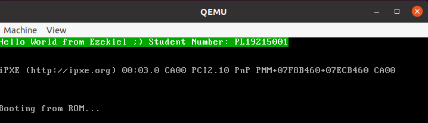

# Multiboot Start

**Ouedraogo Ezekiel**

**PL19215001**

## 1. Abstract

In this experiment, we will develop an operating system (OS) that can output specific content on the screen.

### 1.1. Multiboot Specification

The [Multiboot Specification](https://www.gnu.org/software/grub/manual/multiboot/multiboot.html) is a specification allowing to forward important informations from a bootloader (such as Grub) to the kernel. It also specifies how a bootloader should load a kernel.
According to the multiboot specification, an OS image must contain a Multiboot Header.  In the Multiboot Header, you should have the following fields:

* **magic**, a u32 used to identify the header (value: ***0x1BADB002***)
* **flags**, a u32 field used to specify the needed features.
* **checksum**, a u32 field whose value is ***-(magic + flags)***

### 1.2. QEMU

[QEMU](https://www.qemu.org/) is a generic and open-source machine emulator and virtualizer that supports multiboot specification.

Install QEMU on Linux using following commands:

```cmd
sudo apt-get install qemu
sudo apt-get install qemu-system-i386
```

### 1.3. VGA

The VGA video memory for color monitors resides at ***0xB8000***.
Each character requires two bytes: one to hold the character and one to hold the character's display properties.

Use _`movl <con>, <reg>`_ to write directly into VGA video memory.

e.g., _`movl $0x2f4b2f4f, 0xB8000`_ displays “OK” on the screen.

## 2. Source Code description

### 2.1. Multiboot Header

As required, we define the multiboot magic, flags and checksum.

> _header.S_

___

```nasm
.set FLAGS,    0
.set MAGIC,    0x1BADB002
.set CHECKSUM, -(MAGIC + FLAGS)

.section .multiboot
.align 4
.long MAGIC
.long FLAGS
.long CHECKSUM
```

___

### 2.2. GNU Assembler Code

We write a code to display _“Hello World from Ezekiel 😉 Student Number: PL19215001”_ directly using the VGA port.

> _header.S_

___

```nasm
.section .text
.global _start
_start:
    movl $0x2f652f48, 0xB8000   //He
    movl $0x2f6c2f6c, 0xB8004   //ll
    movl $0x2f202f6f, 0xB8008   //o 
    movl $0x2f6f2f57, 0xB800C   //Wo
    movl $0x2f6c2f72, 0xB8010   //rl
    movl $0x2f202f64, 0xB8014   //d 
    movl $0x2f722f66, 0xB8018   //fr
    movl $0x2f6d2f6f, 0xB801C   //om
    movl $0x2f452f20, 0xB8020   // E
    movl $0x2f652f7a, 0xB8024   //ze
    movl $0x2f692f6b, 0xB8028   //ki
    movl $0x2f6c2f65, 0xB802C   //el
    movl $0x2f3b2f20, 0xB8030   // ;
    movl $0x2f202f29, 0xB8034   //) 
    movl $0x2f742f53, 0xB8038   //St
    movl $0x2f642f75, 0xB803C   //ud
    movl $0x2f6e2f65, 0xB8040   //en
    movl $0x2f202f74, 0xB8044   //t 
    movl $0x2f752f4e, 0xB8048   //Nu
    movl $0x2f622f6d, 0xB804C   //mb
    movl $0x2f722f65, 0xB8050   //er
    movl $0x2f202f3a, 0xB8054   //: 
    movl $0x2f4c2f50, 0xB8058   //PL
    movl $0x2f392f31, 0xB805C   //19
    movl $0x2f312f32, 0xB8060   //21
    movl $0x2f302f35, 0xB8064   //50
    movl $0x2f312f30, 0xB8068   //01
    hlt
```

___

we can already compile the code using _gcc_. This will generate an object file.

```bash
gcc -c ${ASM_FLAGS} header.S -o header.o
```

### 2.3. Linker

We need to link our assembly code with the multiboot header code.

> _header.ld_

___

```bash
OUTPUT_FORMAT("elf32-i386", "elf32-i386", "elf32-i386") 
OUTPUT_ARCH(i386) 
ENTRY(_start)
SECTIONS { 
    . = 1M; 
    .text : { 
        *(.header) 
        *(.text) 
    } 
}
```

___

Now we can generate the **OS kernel** by using the _linker_ command.

```bash
ld -n -T header.ld header.o -o header.bin
```

### 2.4. Make

We will use a Makefile to automate the above tasks.

> _Makefile_

___

```bash
ASM_FLAGS= -m32 --pipe -Wall -fasm -g -O1 -fno-stack-protector

header.bin: header.S
    gcc -c ${ASM_FLAGS} header.S -o header.o 
    ld -n -T header.ld header.o -o header.bin
```

___

## 3. Emulation

As QEMU allow us to run multiboot kernel, we are then ready to run our OS.

> Running OS

```bash
qemu-system-i386 -kernel header.bin
```



In order to automate more tasks we add a _`make clean`_ section to delete the object file and the kernel and a _`make run`_ section  to automate all the process(build, link, run and clean)

> _Makefile_

___

```bash
ASM_FLAGS= -m32 --pipe -Wall -fasm -g -O1 -fno-stack-protector

run:
    make clean
    make header.bin
    qemu-system-i386 -kernel header.bin -machine type=pc-i440fx-3.1
    make clean

header.bin: header.S
    gcc -c ${ASM_FLAGS} header.S -o header.o 
    ld -n -T header.ld header.o -o header.bin

clean:
    rm -rf header.bin header.o
```

___

## 4. Problems encountered and their solutions

This experiment was very challenging since it was our first time in OS development. Most of the concepts was new to us but our big help was "Internet". Websites like [OSDev](https://osdev.org/), [intermezzos](https://intermezzos.github.io/) were very useful.
