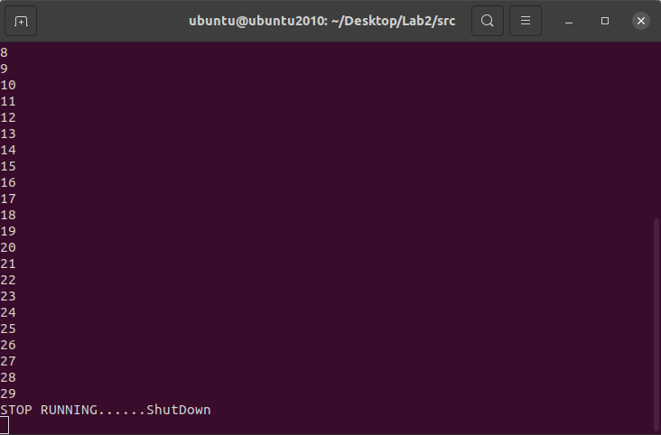
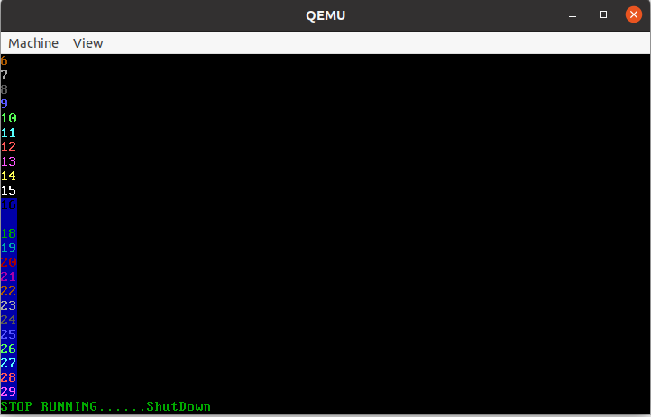

# 操作系统原理与设计

## Multiboot2myMain

---

### 主要功能

---

1. IO
2. uart输出
3. VGA输出
4. 实现myPrint[kf]

---

### 主流程及实现

---

首先根据提供的outb代码写inb

```c
unsigned char inb(unsigned short int port_from){
	unsigned char result;
	__asm__ ("inb %w1, %b0" : "=a" (result) : "d" (port_from));
	return result;
}

void outb (unsigned short int port_to, unsigned char value){
    __asm__ __volatile__ ("outb %b0,%w1"::"a" (value),"Nd" (port_to));
}
```

有了IO后就可以实现uart和VGA输出。

#### _uart_

```c
#define uart_base 0x3F8

void uart_put_char(unsigned char c){
	outb(uart_base,c);
}

unsigned char uart_get_char(void) {
	return inb(uart_base);
}

void uart_put_chars(char *str){ 
	while(*str != '\0') {
		uart_put_char(*str++);
	}
}
```

#### _VGA_

```c
#define VIDEO_ADDRESS 0xb8000
#define MAX_ROWS 25
#define MAX_COLS 80
#define WHITE_ON_BLACK 0x0f
#define VGA_CTRL_REGISTER 0x3d4
#define VGA_DATA_REGISTER 0x3d5
#define VGA_OFFSET_LOW 0x0f
#define VGA_OFFSET_HIGH 0x0e
```

接下来会用到上面的常数。

为了在VGA上输出，要控制光标。

```c
int getRow(int offset) { //get row from offset
    return offset / (2 * MAX_COLS);
}

int getOffset(int col, int row) {
    return 2 * (row * MAX_COLS + col);
}

int newLine(int offset) { //move offset to new line
    return getOffset(0, getRow(offset) + 1);
}

int getCursor() {
    outb(VGA_CTRL_REGISTER, VGA_OFFSET_HIGH);
    int offset = inb(VGA_DATA_REGISTER) << 8;
    outb(VGA_CTRL_REGISTER, VGA_OFFSET_LOW);
    offset += inb(VGA_DATA_REGISTER);
    return offset * 2;
}

void setCursor(int offset) {
    offset /= 2;
    outb(VGA_CTRL_REGISTER, VGA_OFFSET_HIGH);
    outb(VGA_DATA_REGISTER, (unsigned char) (offset >> 8));
    outb(VGA_CTRL_REGISTER, VGA_OFFSET_LOW);
    outb(VGA_DATA_REGISTER, (unsigned char) (offset & 0xff));
}
```

1. 清屏功能

```c
void clear_screen(void) {
    for (int i = 0; i < MAX_COLS * MAX_ROWS; ++i) {
        putChar(' ', i * 2, WHITE_ON_BLACK);
    }
    setCursor(getOffset(0, 0));
}
```

2. 屏幕输出功能

```c
void putChar(char character, int offset, int color) {
    unsigned char *vidmem = (unsigned char *) VIDEO_ADDRESS;
    vidmem[offset] = character;
    vidmem[offset + 1] = color;
}

void copyMemory(char *source, char *dest, int nbytes) {
    int i;
    for (i = 0; i < nbytes; i++) {
        *(dest + i) = *(source + i);
    }
}

int scroll(int offset) {
    copyMemory(
            (char *) (getOffset(0, 1) + VIDEO_ADDRESS),
            (char *) (getOffset(0, 0) + VIDEO_ADDRESS),
            MAX_COLS * (MAX_ROWS - 1) * 2
    );

    for (int col = 0; col < MAX_COLS; col++) {
        putChar(' ', getOffset(col, MAX_ROWS - 1),WHITE_ON_BLACK);
    }

    return offset - 2 * MAX_COLS;
}

void append2screen(char *str,int color){
    int offset = getCursor();
    int i = 0;
    while (str[i] != '\0') {
        if (offset >= MAX_ROWS * MAX_COLS * 2) {
            offset = scroll(offset);
        }
        if (str[i] == '\n') {
            offset = newLine(offset);
        } 
        else {
            putChar(str[i], offset,color);
            offset += 2;
        }
        i++;
    }
    setCursor(offset);
}
```

最后实现myPrint[kf]
myPrint[kf] 是可变参数的函数所以输出前要处理好字符串。 所以利用myVsprintf来处理。

```c
char kBuf[400];
int myPrintk(int color,const char *format, ...){
   va_list args;
   int size;
   
   va_start (args, format);
   size = myVsprintf (&kBuf[0], 400, format, args);
   va_end (args);
   
   kBuf[size]='\0';
   append2screen(kBuf,color);
   uart_put_chars(kBuf);
   return size;
}

char uBuf[400];
int myPrintf(int color,const char *format, ...){
   va_list args;
   int size;
   
   va_start (args, format);
   size = myVsprintf (&uBuf[0], 400, format, args);
   va_end (args);
   
   uBuf[size]='\0';
   append2screen(uBuf,color);
   uart_put_chars(uBuf);
   return size;
}

```

myVsprintf也调用了convert和myPuts。

* convert把一个base进制数num转换字符串。
* myPuts把一个处理好的字符串保存到buf里

```c
char *convert(unsigned int num, int base)  {
	static char Representation[]= "0123456789ABCDEF";
	static char buffer[50]; 
	char *ptr; 
	
	ptr = &buffer[49]; 
	*ptr = '\0'; 
	
	do 
	{ 
		*--ptr = Representation[num%base]; 
		num /= base; 
	}while(num != 0); 
	
	return(ptr); 
}

int myPuts(char* buf, int max, char* data) {
	char* e = data;
	unsigned int i = 0;
	while(i < max && *e != '\0') {
		*buf++ = *e++;
		i++;
	}
	return i;
}

int myVsprintf(char *buf, int max, const char* format, va_list args) {
	char *s;
	unsigned int j;
	unsigned int i = 0;
	int size = 0;
	while(i < max && format[i] != '\0') {
		while(i < max && format[i] != '\0' && format[i] != '%' ) { 
			*buf++ = format[i++];
			size++;
		}
		
		if(i < max && format[i] != '\0') {
			switch(format[++i]) {
				case 'c' :
					j = va_arg(args,int);		//Fetch char argument				
					*buf++ = j;
					size++;
					break; 
				
				case 'd' : 
					j = va_arg(args,int); 		//Fetch Decimal/Integer argument
					if(j<0) { 
						j = -j;
						*buf++ = '-';
					}
					j = myPuts(buf, max-i, convert(j,10));
					buf+=j;
					size+=j;
					break; 
						
				case 'o': 
					j = va_arg(args,unsigned int); //Fetch Octal representation
					j = myPuts(buf, max-i, convert(j,8));
					buf+=j;
					size+=j;
					break; 
				
				case 's': 
					s = va_arg(args,char *); 		//Fetch string
					j = myPuts(buf, max-i, s);
					buf+=j;
					size+=j;
					break; 
						
				case 'x': 
					j = va_arg(args,unsigned int); //Fetch Hexadecimal representation
					j = myPuts(buf, max-i, convert(j,16));
					buf += j;
					size +=j;
					break;
			}
			i++;
		}
	}
	return size;	
}
```

---

### 运行结果

---

```c
void myMain(void){    
    int i;
    
    myPrintk(0x7,"main\n");
    for (i=1;i<30;i++) myPrintf(i,"%d\n",i);
    return;
}
```

#### UART



#### VGA


